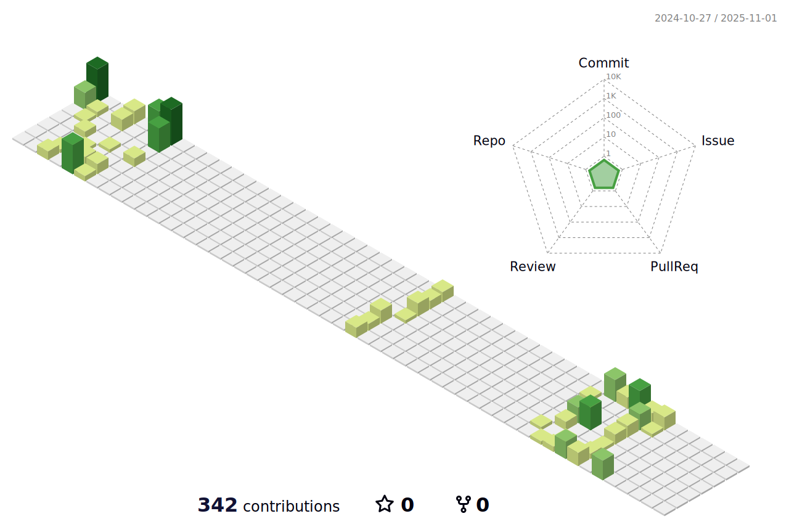

<!-- https://github.com/kyechan99/capsule-render -->

  

<!-- 打字机 -->
<!-- https://github.com/DenverCoder1/readme-typing-svg -->

  

<!-- GitHub 数据概览 -->
<!-- https://github.com/anuraghazra/github-readme-stats -->

<!-- https://github.com/DenverCoder1/github-readme-streak-stats -->

 

<!-- 贡献图 -->
<!-- https://github.com/Ashutosh00710/github-readme-activity-graph -->

 

<!-- https://github.com/anuraghazra/github-readme-stats -->
<!--  -->
<!-- https://github.com/anuraghazra/github-readme-stats -->

 

 

<!-- https://github.com/badges/shields -->

<!-- https://github.com/antonkomarev/github-profile-views-counter -->

<!-- https://github.com/kyechan99/capsule-render -->

